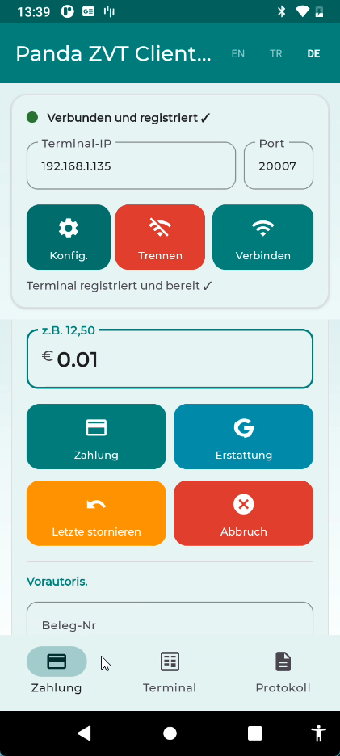
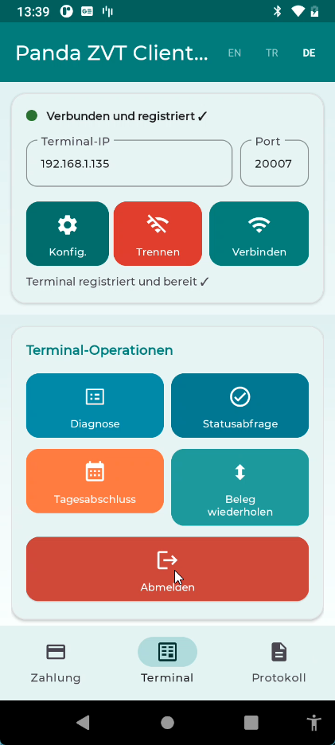
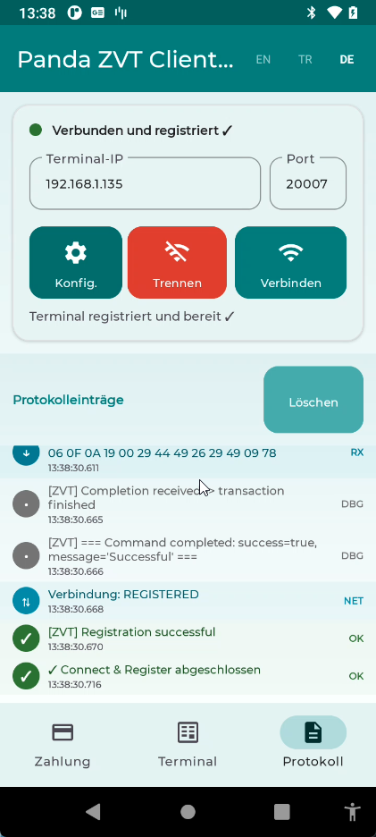
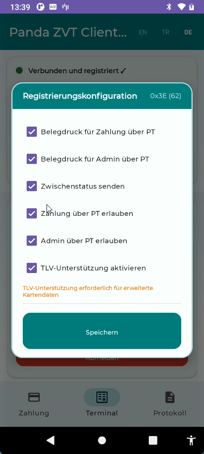
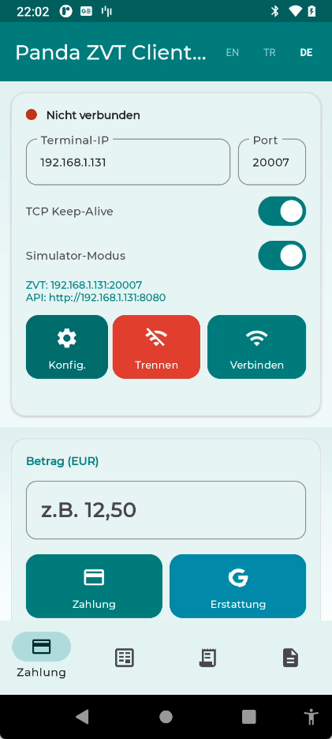
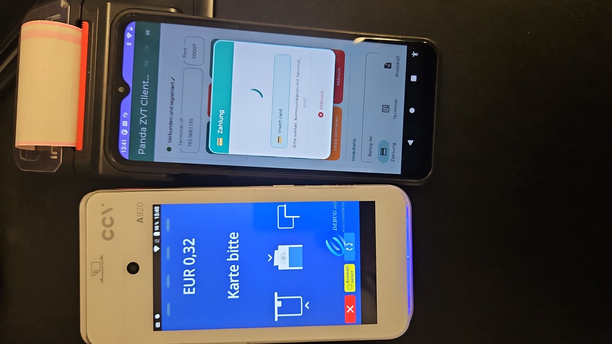

# ZVT Client Library for Android (Kotlin)

> **English** | [Turkce](README_tr.md) | [Deutsch](README_de.md)
>
> **Terminal Simulator:** [panda-zvt-simulator/README.md](panda-zvt-simulator/README.md) — REST API, curl examples, configuration

[](https://central.sonatype.com/artifact/io.github.kaplanerkan/panda-zvt-library)
[](https://jitpack.io/#kaplanerkan/kotlin-zvt-library)

A Kotlin/Android library implementing the **ZVT Protocol (v13.13)** for communication between an Electronic Cash Register (ECR) and Payment Terminals (PT) over TCP/IP.

## Installation

### Maven Central

```kotlin
// build.gradle.kts
dependencies {
    implementation("io.github.kaplanerkan:panda-zvt-library:1.0.0")
}
```

### JitPack

```kotlin
// settings.gradle.kts
dependencyResolutionManagement {
    repositories {
        maven("https://jitpack.io")
    }
}

// build.gradle.kts
dependencies {
    implementation("com.github.kaplanerkan:kotlin-zvt-library:v1.0.1")
}
```

## What is ZVT?

ZVT (Zahlungsverkehrstechnik) is the German standard protocol for communication between point-of-sale systems and payment terminals. It is widely used in Germany, Austria, and Switzerland for card payment processing.

- **Spec**: ZVT Protocol Specification v13.13 (PA00P015_13.13_final)
- **Transport**: TCP/IP, default port **20007**
- **Encoding**: Binary APDU (Application Protocol Data Unit)
- **Resources**: Protocol specifications, documentation and downloads are available at [terminalhersteller.de](https://www.terminalhersteller.de/downloads.aspx)

## Features

- **Full ZVT Protocol v13.13** - 14 command types, 50+ error codes, 25+ intermediate statuses
- **Coroutine-based** - All I/O as suspend functions, no main-thread blocking
- **Broken Pipe detection** - Auto-disconnect on IOException, UI buttons disabled immediately
- **Connection state guard** - Buttons disabled until terminal is REGISTERED
- **Material 3 UI** - Turquoise theme, operation-colored buttons, bottom navigation
- **Multi-language** - English, Turkish, German (runtime switchable)
- **BCD / TLV helpers** - Complete encoding/decoding for protocol data structures
- **Thread-safe** - Synchronized send, IO dispatcher for all socket operations
- **File logging** - 30-day rolling log files with full protocol trace (TX/RX hex)
- **Koin DI** - Singleton client lifecycle, ViewModel injection

## Project Structure

```
zvt-project/
+-- app/                          # Demo Android application
+-- panda-zvt-library/            # ZVT protocol library (reusable)
|   +-- src/main/java/com/panda/zvt_library/
|       +-- ZvtClient.kt          # Main client facade (TCP connection, command execution)
|       +-- ZvtCallback.kt        # Event listener interface
|       +-- model/
|       |   +-- Models.kt         # Data models (TransactionResult, CardData, etc.)
|       +-- protocol/
|       |   +-- ZvtConstants.kt   # All protocol constants (commands, BMPs, error codes)
|       |   +-- ZvtPacket.kt      # APDU packet serialization/deserialization
|       |   +-- ZvtCommandBuilder.kt  # Command builders (Registration, Authorization, etc.)
|       |   +-- ZvtResponseParser.kt  # Response parser (BMP fields, TLV containers)
|       +-- util/
|           +-- TlvParser.kt      # TLV (Tag-Length-Value) parser/builder
|           +-- BcdHelper.kt      # BCD encoding/decoding utilities
|           +-- ByteExtensions.kt # Byte array extension functions
+-- panda-zvt-simulator/          # ZVT terminal simulator (Ktor, pure JVM)
|   +-- src/main/kotlin/com/panda/zvt/simulator/
|       +-- Main.kt               # Entry point, CLI args
|       +-- SimulatorServer.kt    # Orchestrator (TCP + HTTP servers)
|       +-- protocol/             # APDU, BCD, BMP encoding (self-contained)
|       +-- handler/              # 13 command handlers (Registration, Payment, etc.)
|       +-- tcp/                  # Raw TCP server (port 20007)
|       +-- api/                  # HTTP REST management API (port 8080)
+-- gradle/
    +-- libs.versions.toml        # Centralized dependency management
```

## Screenshots

| Payment Tab | Pre-Auth Tab | Terminal Tab |
|:-----------:|:------------:|:------------:|
|  |  |  |

| Connection & Log | Transaction Result | Registration Config |
|:----------------:|:------------------:|:-------------------:|
|  |  |  |

| Simulator Mode | Real Terminal (CCV A920) |
|:--------------:|:-----------------------:|
|  |  |

## Demo App

The demo application (`app/`) is a fully functional ZVT client with Material 3 UI.

### What You Can Do

| Screen | Operations |
|--------|-----------|
| **Connection** | Connect to terminal via IP:Port, auto-register, disconnect |
| **Payment** | Payment, Refund, Reversal, Abort |
| **Pre-Auth** | Pre-Authorization, Book Total (close pre-auth), Partial Reversal |
| **Terminal** | Diagnosis, Status Enquiry, End of Day, Repeat Receipt, Log Off |
| **Log** | Live protocol log viewer with timestamps and severity levels |

### UI Features

- Operation-colored buttons (teal for payments, cyan for queries, amber for reversals, red for abort/disconnect)
- All buttons disabled until terminal is connected and registered
- Real-time intermediate status display ("Insert card", "Enter PIN", etc.)
- Transaction result card with card data, trace/receipt numbers, date/time
- Receipt printing support (print lines from terminal)
- Connection state indicator (red/green dot)
- Language switcher (EN/TR/DE) in toolbar
- Registration Config dialog for configByte customization

### Registration Config Dialog

The Registration Config dialog (gear icon on connection screen) allows customizing the **configByte** sent during Registration (06 00). Each checkbox maps to a bit in the config byte:

| Checkbox | Bit | Hex | Description |
|----------|-----|-----|-------------|
| Receipt Payment | 1 | `0x02` | ECR prints payment receipts (otherwise terminal prints) |
| Receipt Admin | 2 | `0x04` | ECR prints admin/settlement receipts |
| Intermediate Status | 3 | `0x08` | Terminal sends status messages ("Insert card", "Enter PIN") |
| Allow Payment | 4 | `0x10` | ECR controls payment function |
| Allow Admin | 5 | `0x20` | ECR controls admin functions |
| TLV Support | - | - | Include BMP 06 TLV container with permitted commands (separate flag) |

**Default:** `0x08` (only Intermediate Status enabled). The configByte is displayed in real-time as hex and decimal. Settings are persisted in SharedPreferences.

| Registration Config Dialog |
|:-:|
|  |

## Screenshots

| Payment Screen | Payment (scroll) | Terminal Operations |
|:-:|:-:|:-:|
|  |  |  |

| Protocol Logs | Registration Config | Live Payment with CCV A920 |
|:-:|:-:|:-:|
|  |  |  |

| Transaction Result (Detail Popup) |
|:-:|
|  |

## All Transaction Types at a Glance

| Button | Command | What it does | Requires |
|--------|---------|-------------|----------|
| **Payment** | `06 01` | Charges the customer's card | Amount + Card |
| **Refund** | `06 31` | New independent refund transaction — money goes back to customer | Amount + Card |
| **Reversal** | `06 30` | Cancels a previous payment (as if it never happened) | Receipt number + Card |
| **Pre-Auth** | `06 22` | Blocks (reserves) an amount on the card without charging | Amount + Card |
| **Book Total** | `06 24` | Completes a Pre-Auth by charging the actual amount | Receipt number + Trace + AID |
| **Pre-Auth Reversal** | `06 25` | Fully cancels a Pre-Auth, releasing the blocked amount | Receipt number |
| **Abort** | `06 B0` | Cancels the currently running operation | - |

**Payment (06 01):** Standard card payment. Customer presents card, amount is charged immediately. Returns receipt number, trace number, and card data.

**Refund (06 31) - Gutschrift:** A completely new, independent transaction that sends money back to the customer's card. Does not reference any previous transaction. Can be done days or weeks later. Processing fees apply.

**Reversal (06 30) - Storno:** Cancels an existing payment using its receipt number. The original transaction is deleted on the host. Must be done on the same day (before end-of-day settlement). No processing fees.

**Pre-Auth (06 22) - Vorautorisierung:** Blocks an amount on the card without actually charging it. Used for hotels, car rentals, restaurants. Returns a receipt number needed for Book Total.

**Book Total (06 24) - Buchung:** Completes a Pre-Auth by charging the final amount. The charged amount can be less than or equal to the reserved amount — the difference is automatically released. Requires the **receipt number**, **trace number** (BMP 0x0B), and **AID** (BMP 0x3B) from the original Pre-Auth response. The spec mandates trace and AID for reservation booking. Does **not** send a password (unlike Payment/Refund). Customer must present the card again.

**Pre-Auth Reversal (06 25) - Vorautorisierung Storno:** Fully cancels a pre-authorization, releasing the entire blocked amount back to the customer. Does **not** send a password. Requires the **receipt number** from the Pre-Auth. Amount is optional. Customer must present the card again. Note: The real "Partial Reversal" (reducing a reserved amount) is command `06 23`, which is a different command.

**Abort (06 B0) - Abbruch:** Cancels the currently running operation on the terminal (e.g., if the customer changes their mind while the card is being read).

### Test Results (CCV A920, February 2025)

All 7 operations have been tested on a real CCV A920 terminal with Debit Mastercard and girocard:

| # | Operation | Command | Test | Result |
|---|-----------|---------|------|--------|
| 1 | Payment | `06 01` | 0.10 EUR, girocard | Successful |
| 2 | Refund | `06 31` | 0.10 EUR, Debit Mastercard | Successful |
| 3 | Reversal | `06 30` | Cancel payment by receipt number | Successful |
| 4 | Pre-Auth | `06 22` | 0.30 EUR, Debit Mastercard | Successful |
| 5 | Book Total | `06 24` | Book pre-auth with trace + AID | Successful |
| 6 | Pre-Auth Reversal | `06 25` | Cancel pre-auth by receipt number | Successful |
| 7 | Abort | `06 B0` | Cancel running operation | Successful |
| 8 | Diagnosis | `06 70` | Terminal host connectivity check | Successful |
| 9 | Status Enquiry | `05 01` | Terminal state query | Successful |
| 10 | End of Day | `06 50` | Daily batch close (0.60 EUR total) | Successful |
| 11 | Repeat Receipt | `06 20` | Last receipt copy (full detail) | Successful |
| 12 | Log Off | `06 02` | Graceful disconnect | Successful |

## Terminal Operations (Detail Popups)

All terminal operations show their results in a **full-screen detail popup** that stays open until the user taps OK:

| Operation | Popup Shows |
|-----------|------------|
| **Diagnosis** | Status, connection state, Terminal ID, error details |
| **Status Enquiry** | Connection state, Terminal ID, status message |
| **End of Day** | Status, total amount, message + auto-fetched last receipt |
| **Repeat Receipt** | Full transaction details: amount, trace, receipt, card data, date/time, receipt lines |
| **Log Off** | Success/failure status |

### End of Day + Auto Repeat Receipt

When End of Day completes successfully, the app **automatically triggers Repeat Receipt** to fetch the last transaction receipt. Both results are combined in a single popup showing:
- End of Day status and total amount (from BMP 0x04)
- Detailed receipt lines from the terminal (via Repeat Receipt)

This gives the user a complete view of the daily close with the last transaction details in one screen.

## Memory & Resource Safety

The library and app include defensive measures against memory leaks and resource leaks:

| Component | Protection |
|-----------|-----------|
| **ZvtClient** | `@Volatile` callback field for thread-safe access |
| **ZvtClient** | `Collections.synchronizedList()` for receipt lines (concurrent access from IO coroutines) |
| **ZvtClient** | Socket cleanup on connection error paths (prevents file descriptor leaks) |
| **ZvtClient** | Full cleanup on `disconnect()` / `destroy()`: callback, receipt lines, intermediate status |
| **ZvtClient** | `handleConnectionLost()` saves callback locally before cleanup to prevent use-after-clear |
| **ProgressStatusDialog** | Handler callbacks guarded with `_binding != null` check (prevents post-destroy crashes) |
| **ProgressStatusDialog** | `onCancelClick` lambda cleared in `onDestroyView()` (prevents Activity/Fragment leak) |
| **FileLoggingTree** | `shutdown()` method for executor cleanup |
| **All Fragments** | Proper `_binding = null` in `onDestroyView()`, observers scoped to `viewLifecycleOwner` |

## Reversal (Storno) vs Refund (Gutschrift)

These two operations are often confused. Here is the key difference:

**Storno / Reversal (06 30):**
- **Cancels** an existing payment (as if it never happened)
- References the original transaction via receipt number
- Must generally be done **on the same day** (before end-of-day settlement)
- Customer may need to present the card again (terminal dependent)
- The original transaction is **deleted/cancelled** on the host
- Usually **no processing fee** is charged
- Example: Wrong amount entered at the register, correct it immediately

**Gutschrift / Refund (06 31):**
- A completely **new and independent** transaction
- Does **not** reference the original transaction
- Can be done **days or weeks later** (no time limit)
- Customer **must** present the card
- Creates a **separate record** on the host
- Processing fee **is charged** (it is a new transaction)
- Example: Customer returns a product, give the money back

**Summary:**

| | Reversal (Storno) | Refund (Gutschrift) |
|---|---|---|
| Transaction type | Cancels original | New independent transaction |
| Time limit | Same day (before end-of-day) | No limit |
| Receipt number | Required | Not required |
| Processing fee | None | Yes |
| Card | Terminal dependent | Must be presented |
| Host record | Original is deleted | Separate record created |

In short: Reversal = "this transaction never happened", Refund = "make a new refund payment".

## Pre-Authorization Flow (Vorautorisierung)

Pre-Authorization is used to **reserve (block) an amount** on a customer's card without actually charging it. The actual charge happens later with Book Total, or the reservation can be partially or fully released.

**Use cases:**
- **Hotel:** Block 500 EUR at check-in, charge the actual amount at check-out
- **Car rental:** Reserve 1000 EUR as deposit, charge the real cost after return
- **Restaurant:** Block the bill amount, charge with tip included later

**Flow:**

```
1. Pre-Auth (06 22)       -> Block amount on card -> receipt number returned
   Customer uses the service...
2. Book Total (06 24)     -> Charge actual amount (receipt number required)
   OR
   Partial Reversal (06 25) -> Release part of the blocked amount
```

**Step 1: Pre-Authorization (06 22)**
- Sends the amount and currency to the terminal
- Customer presents the card (insert/tap)
- The amount is **blocked** on the customer's account but **not charged**
- Returns a **receipt number** — this is required for the next step

**Step 2a: Book Total (06 24)**
- Completes the pre-authorization by charging the actual amount
- Requires three values from the Pre-Auth response:
  - **Receipt number** (BMP 0x87) — identifies the original pre-authorization
  - **Trace number** (BMP 0x0B) — must be sent for reservation booking (spec requirement)
  - **AID** (BMP 0x3B) — must be sent for reservation booking (spec requirement)
- Does **not** send a password (unlike Payment/Refund/Reversal)
- The charged amount can be **less than or equal to** the blocked amount (amount is optional — if omitted, full pre-auth is booked)
- Customer must present the card again
- Example: Pre-Auth 100 EUR, Book Total 85 EUR (remaining 15 EUR is released)

**APDU format:** `06 24 xx  87(receipt-no) [04(amount)] 0B(trace) 3B(AID)`

**Step 2b: Pre-Auth Reversal (06 25)**
- Fully cancels the pre-authorization, releasing the entire blocked amount
- Requires the **receipt number** (BMP 0x87) from the Pre-Auth
- Does **not** send a password (same as Book Total)
- Amount is optional (if omitted, full pre-auth is reversed)
- Customer must present the card again
- Example: Pre-Auth 100 EUR, Pre-Auth Reversal → 100 EUR released

**APDU format:** `06 25 xx  87(receipt-no) [04(amount)]`

**Summary:**

| Command | Hex | Purpose | Requires |
|---------|-----|---------|----------|
| Pre-Authorization | `06 22` | Block amount on card | Amount + Card |
| Book Total | `06 24` | Charge blocked amount | Receipt number + Trace + AID (+ optional Amount) |
| Pre-Auth Reversal | `06 25` | Cancel pre-auth, release blocked amount | Receipt number (+ optional Amount) |

## ZVT Command Hex Codes

### ECR -> Terminal Commands

| Command | Hex Code | Description |
|---------|----------|-------------|
| Registration | `06 00` | Register ECR with terminal, set currency and config |
| Authorization | `06 01` | Payment transaction (amount in BCD) |
| Log Off | `06 02` | Graceful disconnect from terminal |
| Abort | `06 B0` | Cancel an ongoing operation (ECR→PT) |
| Repeat Receipt | `06 20` | Re-print last receipt |
| Pre-Authorization | `06 22` | Reserve amount (hotel, car rental) |
| Book Total | `06 24` | Complete a pre-authorization |
| Partial Reversal | `06 25` | Partially reverse a transaction |
| Reversal | `06 30` | Cancel a previous transaction |
| Refund | `06 31` | Refund a transaction |
| End of Day | `06 50` | Close daily batch |
| Diagnosis | `06 70` | Query terminal status |
| Status Enquiry | `05 01` | Check terminal state |

### Terminal -> ECR Responses

| Response | Hex Code | Description |
|----------|----------|-------------|
| ACK | `80 00 00` | Positive acknowledgement |
| NACK | `84 00 00` | Negative acknowledgement (command rejected) |
| Completion | `06 0F` | Transaction finished |
| Status Information | `04 0F` | Transaction result with BMP fields |
| Intermediate Status | `04 FF` | "Insert card", "Enter PIN", etc. |
| Print Line | `06 D1` | Single receipt line |
| Print Text Block | `06 D3` | Block of receipt text |
| Abort | `06 1E` | Transaction aborted by terminal |

> **Note on Abort (06 B0 vs 06 1E):** The ZVT protocol uses two different abort codes depending on the direction. `06 B0` is the ECR→PT command used to cancel an ongoing transaction from the ECR side. `06 1E` is the PT→ECR response sent by the terminal to inform the ECR that a transaction was aborted (e.g. user pressed cancel on the terminal). Using `06 1E` as an ECR→PT command does not work — the terminal ignores it because it is a response code, not a command.

### APDU Packet Format

```
[CMD_CLASS(1)] [CMD_INSTR(1)] [LEN(1-3)] [DATA(N)]

Length encoding:
  0x00-0xFE  -> 1 byte length (0-254 bytes data)
  0xFF LL HH -> 3 byte extended length (little-endian, up to 65535 bytes)

Examples:
  06 00 08 ...        -> Registration, 8 bytes data
  06 01 07 ...        -> Authorization, 7 bytes data
  80 00 00            -> ACK (no data)
  04 FF 03 ...        -> Intermediate Status, 3 bytes data
```

### Example: Registration Packet

```
TX: 06 00 08 00 00 00 08 09 78 03 00
     |  |  |  |        |  |     |  |
     |  |  |  +--------+  |     |  +-- Service byte value (0x00)
     |  |  |  Password     |     +-- BMP 0x03 (Service byte tag)
     |  |  |  (000000 BCD) |
     |  |  |               +-- Currency code (0978 = EUR, positional)
     |  |  +-- Length: 8 bytes
     |  +-- Instruction: 0x00
     +-- Class: 0x06 (Registration)
```

### Example: Authorization Packet

```
TX: 06 01 07 04 00 00 00 01 00 19 40
     |  |  |  |  |              |  |
     |  |  |  |  +--------------+  +-- Payment type EC-Cash (0x40)
     |  |  |  |  Amount: 000001 00     BMP 0x19
     |  |  |  |  = 1.00 EUR (BCD)
     |  |  |  +-- BMP 0x04 (Amount tag)
     |  |  +-- Length: 7 bytes
     +--+-- Command: 06 01 (Authorization)
```

## Result Codes (BMP 0x27)

| Code | Constant | Description |
|------|----------|-------------|
| `00` | `RC_SUCCESS` | Successful |
| `64` | `RC_CARD_NOT_READABLE` | Card not readable (LRC/parity error) |
| `65` | `RC_CARD_DATA_NOT_PRESENT` | Card data not present |
| `66` | `RC_PROCESSING_ERROR` | Processing error |
| `6C` | `RC_ABORT_VIA_TIMEOUT` | Abort via timeout or abort key |
| `6F` | `RC_WRONG_CURRENCY` | Wrong currency |
| `78` | `RC_CARD_EXPIRED` | Card expired |
| `7D` | `RC_COMMUNICATION_ERROR` | Communication error |
| `9A` | `RC_ZVT_PROTOCOL_ERROR` | ZVT protocol error |
| `A0` | `RC_RECEIVER_NOT_READY` | Receiver not ready |
| `B4` | `RC_ALREADY_REVERSED` | Already reversed |
| `B5` | `RC_REVERSAL_NOT_POSSIBLE` | Reversal not possible |
| `C2` | `RC_DIAGNOSIS_REQUIRED` | Diagnosis required |
| `C3` | `RC_MAX_AMOUNT_EXCEEDED` | Maximum amount exceeded |
| `FF` | `RC_SYSTEM_ERROR` | System error |

> Full list: 50+ result codes defined in `ZvtConstants.kt`

## Intermediate Status Codes (04 FF)

| Code | Message |
|------|---------|
| `00` | Waiting for amount confirmation |
| `01` | Please watch PIN-pad |
| `04` | Waiting for FEP response |
| `0A` | Insert card |
| `0B` | Please remove card |
| `0E` | Please wait |
| `15` | Incorrect PIN |
| `18` | PIN try limit exceeded |
| `1C` | Approved, please take goods |
| `1D` | Declined |

## BMP Fields Parsed

| BMP | Name | Format |
|-----|------|--------|
| `04` | Amount | 6 byte BCD |
| `06` | TLV Container | BER-TLV length |
| `0B` | Trace Number | 3 byte BCD |
| `0C` | Time (HHMMSS) | 3 byte BCD |
| `0D` | Date (MMDD) | 2 byte BCD |
| `0E` | Expiry Date (YYMM) | 2 byte BCD |
| `17` | Card Sequence Number | 2 byte BCD |
| `19` | Payment Type | 1 byte |
| `22` | PAN/EF_ID | LLVAR BCD |
| `27` | Result Code | 1 byte |
| `29` | Terminal ID | 4 byte BCD |
| `2A` | VU Number | 15 byte ASCII |
| `37` | Original Trace | 3 byte BCD |
| `3B` | AID | 8 byte fixed |
| `3C` | Additional Data/TLV | LLLVAR |
| `49` | Currency Code | 2 byte BCD |
| `87` | Receipt Number | 2 byte BCD |
| `88` | Turnover Number | 3 byte BCD |
| `8A` | Card Type | 1 byte |
| `8B` | Card Name | LLVAR ASCII |
| `8C` | Card Type ID Network | 1 byte |
| `A0` | Result Code AS | 1 byte |
| `BA` | AID Parameter | 5 byte fixed |

## Card Type IDs (BMP 0x8A)

Based on ZVT Spec v13.13, Chapter 12: "List of ZVT-card-type IDs".

| ID (dec) | Hex | Card Type |
|----------|-----|-----------|
| 5 | `0x05` | girocard |
| 6 | `0x06` | Mastercard |
| 8 | `0x08` | American Express |
| 10 | `0x0A` | Visa |
| 11 | `0x0B` | Visa Electron |
| 12 | `0x0C` | Diners |
| 13 | `0x0D` | V PAY |
| 14 | `0x0E` | JCB |
| 30 | `0x1E` | Geldkarte |
| 46 | `0x2E` | Maestro |
| 87 | `0x57` | Bancontact |
| 97 | `0x61` | Alipay |
| 198 | `0xC6` | CUP (China UnionPay) |
| 232 | `0xE8` | Discover |
| 255 | `0xFF` | See TLV tag 41 (ID >= 256) |

> Full list: 280+ card types defined in ZVT Spec Chapter 12. IDs >= 256 use TLV tag 41 instead of BMP 0x8A.

## Usage

```kotlin
val config = ZvtConfig(
    host = "192.168.1.100",
    port = 20007,
    password = "000000",
    currencyCode = 978, // EUR
    debugMode = true
)

val client = ZvtClient(config)

// Connect and register
client.connect()
client.register(configByte = ZvtConstants.REG_INTERMEDIATE_STATUS)

// Payment (12.50 EUR)
val result = client.authorize(amountInCents = 1250)
if (result.success) {
    println("Payment successful! Trace: ${result.traceNumber}")
    println("Card: ${result.cardData?.cardType}")
}

// Pre-Authorization flow
val preAuth = client.preAuthorize(amountInCents = 5000) // Reserve 50.00 EUR
// Book Total requires receipt, trace, and AID from the Pre-Auth response
val booking = client.bookTotal(
    receiptNumber = preAuth.receiptNumber,
    amountInCents = 4200, // Book 42.00 EUR (optional — omit to book full amount)
    traceNumber = preAuth.traceNumber,
    aid = preAuth.cardData?.aid
)

// Pre-Auth Reversal
val reversal = client.preAuthReversal(receiptNumber = preAuth.receiptNumber) // Full reversal

// Repeat last receipt
val receipt = client.repeatReceipt()

// End of day
val eod = client.endOfDay()

// Disconnect
client.logOff()
client.disconnect()
```

## Protocol Flow

```
ECR -> PT:  Command APDU (e.g. 06 01 for Authorization)
PT  -> ECR: ACK (80 00 00)
PT  -> ECR: Intermediate Status (04 FF) [repeated] - "Insert card", "Enter PIN"...
ECR -> PT:  ACK (80 00 00) [for each]
PT  -> ECR: Status Information (04 0F) - Transaction result with BMP fields
ECR -> PT:  ACK (80 00 00)
PT  -> ECR: Print Line (06 D1) [repeated] - Receipt lines
ECR -> PT:  ACK (80 00 00) [for each]
PT  -> ECR: Completion (06 0F) or Abort (06 1E)
ECR -> PT:  ACK (80 00 00)
```

## Troubleshooting / Log Files

The application automatically writes log files to the device storage. Logs are kept for **30 days** and old files are automatically deleted.

**Log file location:**
```
Android/data/com.panda_erkan.zvtclientdemo/files/Download/logs/zvt_YYYY-MM-DD.log
```

**How to access:**
1. Connect the device to a computer via USB
2. Open the device storage and navigate to the path above
3. Or use a file manager app on the device

**Log format:**
```
2026-02-10 14:30:15.123 D/ZVT: ECR -> PT | TX Registration (06 00) | 11 bytes | 06-00-08-00-00-00-08-09-78-03-00
2026-02-10 14:30:15.456 D/ZVT: PT -> ECR | RX ACK (80 00) | 3 bytes | 80-00-00
```

If you encounter a problem, please attach the relevant log file when reporting an issue.

## Build

```bash
./gradlew :panda-zvt-library:assembleDebug   # Library only
./gradlew :app:assembleDebug                 # Demo app
./gradlew :panda-zvt-simulator:build         # Simulator
```

## Terminal Simulator (panda-zvt-simulator)

A pure Kotlin/JVM application that simulates a ZVT payment terminal. Develop and test your ECR client **without real hardware** — the simulator returns the exact same binary responses as a real CCV A920 terminal.

**For detailed simulator documentation, all curl examples, configuration options, and architecture:** see [panda-zvt-simulator/README.md](panda-zvt-simulator/README.md)

### Running the Simulator

```bash
# Start with default settings (ZVT: 20007, API: 8080)
./gradlew :panda-zvt-simulator:run

# Custom ports and terminal ID
./gradlew :panda-zvt-simulator:run --args="--zvt-port 20007 --api-port 8080 --terminal-id 29001234"
```

The simulator starts two servers:
- **ZVT TCP** on port `20007` — binary ZVT protocol (connect your Android app here)
- **HTTP API** on port `8080` — REST management API (configure card data, delays, errors)

### Connecting from Android

The demo app has a **Simulator Mode** toggle. When enabled, the Ktor simulator server starts **embedded on the Android device itself** (TCP:20007 + HTTP:8080).

| Mode | Simulator IP | HTTP API | Description |
|------|-------------|----------|-------------|
| **Embedded (toggle ON)** | Device's own IP | `http://<device_ip>:8080` | Simulator runs on the Android device |
| **Standalone (PC)** | PC's LAN IP | `http://<pc_ip>:8080` | Simulator runs as standalone JVM on PC |

### REST Management API

| Method | Path | Description |
|--------|------|-------------|
| `GET` | `/api/status` | Simulator status |
| `GET` | `/api/config` | Current config |
| `PUT` | `/api/config` | Update full config |
| `PUT` | `/api/error` | Error simulation (enable, percentage, forced code) |
| `PUT` | `/api/card` | Change card data (PAN, type, name, AID) |
| `PUT` | `/api/delays` | Response timing (intermediate, processing, ACK timeout) |
| `GET` | `/api/transactions` | List transactions |
| `GET` | `/api/transactions/last` | Last transaction |
| `DELETE` | `/api/transactions` | Clear transactions |
| `POST` | `/api/reset` | Full reset |

### Operation Endpoints (REST)

| Method | Path | Body | Description |
|--------|------|------|-------------|
| `POST` | `/api/operations/payment` | `{"amount": 12.50}` | Payment |
| `POST` | `/api/operations/refund` | `{"amount": 12.50}` | Refund |
| `POST` | `/api/operations/reversal` | `{"receiptNo": 1}` | Reversal |
| `POST` | `/api/operations/pre-auth` | `{"amount": 50.00}` | Pre-Authorization |
| `POST` | `/api/operations/book-total` | `{"amount": 50.00, "receiptNo": 1}` | Book Total (capture) |
| `POST` | `/api/operations/pre-auth-reversal` | `{"receiptNo": 1}` | Pre-Auth Reversal |
| `POST` | `/api/operations/end-of-day` | _(empty)_ | End of Day |
| `POST` | `/api/operations/diagnosis` | _(empty)_ | Diagnosis |
| `POST` | `/api/operations/status-enquiry` | _(empty)_ | Status Enquiry |
| `POST` | `/api/operations/repeat-receipt` | _(empty)_ | Repeat Receipt |
| `POST` | `/api/operations/registration` | _(empty)_ | Registration |
| `POST` | `/api/operations/log-off` | _(empty)_ | Log Off |
| `POST` | `/api/operations/abort` | _(empty)_ | Abort |

### Curl Examples

```bash
# Payment
curl -X POST http://localhost:8080/api/operations/payment \
  -H "Content-Type: application/json" -d '{"amount": 25.50}'

# Refund
curl -X POST http://localhost:8080/api/operations/refund \
  -H "Content-Type: application/json" -d '{"amount": 5.00}'

# Reversal
curl -X POST http://localhost:8080/api/operations/reversal \
  -H "Content-Type: application/json" -d '{"receiptNo": 1}'

# Pre-Authorization
curl -X POST http://localhost:8080/api/operations/pre-auth \
  -H "Content-Type: application/json" -d '{"amount": 100.00}'

# Book Total
curl -X POST http://localhost:8080/api/operations/book-total \
  -H "Content-Type: application/json" -d '{"amount": 85.00, "receiptNo": 1}'

# End of Day
curl -X POST http://localhost:8080/api/operations/end-of-day

# Diagnosis
curl -X POST http://localhost:8080/api/operations/diagnosis

# Enable error simulation
curl -X PUT http://localhost:8080/api/error \
  -H "Content-Type: application/json" -d '{"enabled": true, "errorCode": 104}'

# Change card to Visa
curl -X PUT http://localhost:8080/api/card \
  -H "Content-Type: application/json" \
  -d '{"pan": "4111111111111111", "cardType": 10, "cardName": "Visa"}'

# Reset simulator
curl -X POST http://localhost:8080/api/reset
```

> **See [panda-zvt-simulator/README.md](panda-zvt-simulator/README.md) for full documentation:** all 22 REST endpoints with curl examples, configuration, error simulation, architecture, and more.

## Requirements & Tech Stack

| Category | Technology | Version |
|----------|-----------|---------|
| Language | Kotlin | 2.3.10 |
| Min SDK | Android | API 24 (Android 7.0) |
| Target/Compile SDK | Android | API 36 |
| JVM Target | Java | 17 |
| Build System | Gradle (AGP) | 8.13.2 |
| UI Framework | Material Design 3 | 1.13.0 |
| Architecture | MVVM | - |
| DI Framework | Koin | 4.1.1 |
| Async | Kotlin Coroutines | 1.10.2 |
| Navigation | Jetpack Navigation | 2.9.7 |
| Lifecycle | Jetpack Lifecycle (ViewModel, LiveData, StateFlow) | 2.10.0 |
| View Binding | Android Data Binding | - |
| Logging | Timber | 5.0.1 |
| Leak Detection | LeakCanary (debug only) | 2.14 |
| UI Components | RecyclerView, CardView, ConstraintLayout | latest |

## License

```
MIT License

Copyright (c) 2026 Erkan Kaplan

Permission is hereby granted, free of charge, to any person obtaining a copy
of this software and associated documentation files (the "Software"), to deal
in the Software without restriction, including without limitation the rights
to use, copy, modify, merge, publish, distribute, sublicense, and/or sell
copies of the Software, and to permit persons to whom the Software is
furnished to do so, subject to the following conditions:

The above copyright notice and this permission notice shall be included in all
copies or substantial portions of the Software.

THE SOFTWARE IS PROVIDED "AS IS", WITHOUT WARRANTY OF ANY KIND, EXPRESS OR
IMPLIED, INCLUDING BUT NOT LIMITED TO THE WARRANTIES OF MERCHANTABILITY,
FITNESS FOR A PARTICULAR PURPOSE AND NONINFRINGEMENT. IN NO EVENT SHALL THE
AUTHORS OR COPYRIGHT HOLDERS BE LIABLE FOR ANY CLAIM, DAMAGES OR OTHER
LIABILITY, WHETHER IN AN ACTION OF CONTRACT, TORT OR OTHERWISE, ARISING FROM,
OUT OF OR IN CONNECTION WITH THE SOFTWARE OR THE USE OR OTHER DEALINGS IN THE
SOFTWARE.
```
