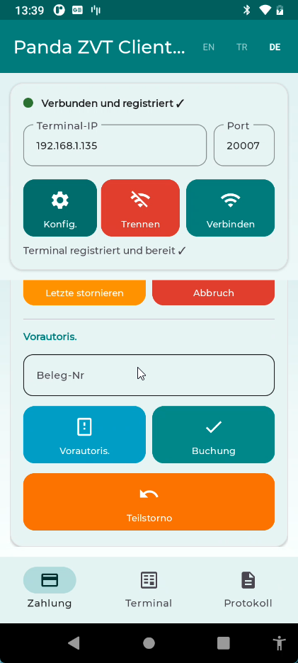
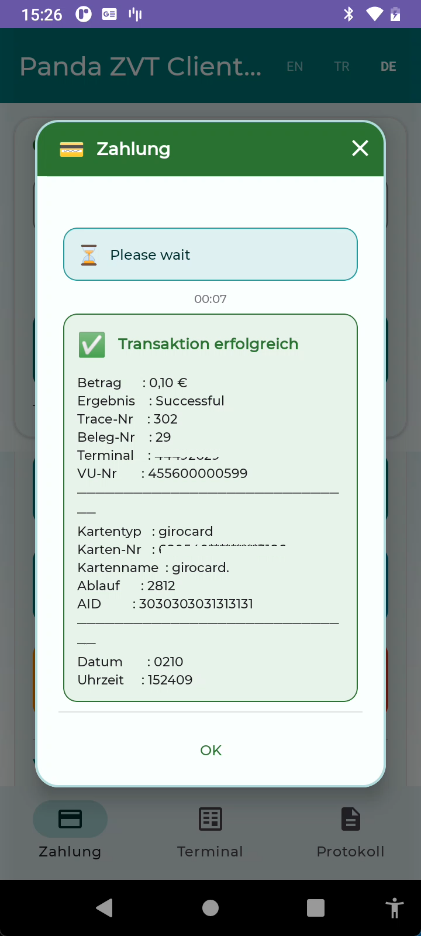

# Android icin ZVT Istemci Kutuphanesi (Kotlin)

> [English](README.md) | **Turkce** | [Deutsch](README_de.md)

Android icin **ZVT Protokolu (v13.13)** uygulayan bir Kotlin kutuphanesi. Yazar Kasa (ECR) ile Odeme Terminalleri (PT) arasinda TCP/IP uzerinden iletisim saglar.

## ZVT Nedir?

ZVT (Zahlungsverkehrstechnik), satis noktasi (POS) sistemleri ile odeme terminalleri arasindaki iletisimi saglayan Alman standart protokoludur. Almanya, Avusturya ve Isvicre'de kartli odeme islemlerinde yaygin olarak kullanilir.

- **Spesifikasyon**: ZVT Protokol Spesifikasyonu v13.13 (PA00P015_13.13_final)
- **Iletisim**: TCP/IP, varsayilan port **20007**
- **Kodlama**: Ikili APDU (Uygulama Protokol Veri Birimi)
- **Kaynaklar**: Protokol spesifikasyonlari, dokumantasyon ve indirmeler icin [terminalhersteller.de](https://www.terminalhersteller.de/downloads.aspx) adresini ziyaret edebilirsiniz

## Ozellikler

- **Tam ZVT Protokol v13.13** - 14 komut tipi, 50+ hata kodu, 25+ ara durum kodu
- **Coroutine tabanli** - Tum I/O suspend fonksiyonlarla, ana thread'i bloke etmez
- **Broken Pipe algilama** - IOException'da otomatik baglanti kesme, butonlar aninda devre disi
- **Baglanti durumu korumasi** - Terminal REGISTERED olana kadar butonlar devre disi
- **Material 3 UI** - Turkuaz tema, isleme gore renkli butonlar, alt gezinme
- **Coklu dil** - Ingilizce, Turkce, Almanca (calisma zamaninda degistirilebilir)
- **BCD / TLV yardimcilari** - Protokol veri yapilari icin hazir util siniflari
- **Thread-safe** - Senkronize gonderim, IO dispatcher uzerinde calisma
- **Dosya loglama** - 30 gunluk donen log dosyalari, tam protokol izleme (TX/RX hex)
- **Koin DI** - Singleton client yasam dongusu, ViewModel enjeksiyonu

## Proje Yapisi

```
zvt-project/
+-- app/                          # Demo Android uygulamasi
+-- panda-zvt-library/            # ZVT protokol kutuphanesi (yeniden kullanilabilir)
|   +-- src/main/java/com/panda/zvt_library/
|       +-- ZvtClient.kt          # Ana istemci (TCP baglanti, komut yurutme)
|       +-- ZvtCallback.kt        # Olay dinleyici arayuzu
|       +-- model/
|       |   +-- Models.kt         # Veri modelleri (islem sonucu, kart bilgisi vb.)
|       +-- protocol/
|       |   +-- ZvtConstants.kt   # Tum protokol sabitleri (komutlar, BMP'ler, hata kodlari)
|       |   +-- ZvtPacket.kt      # APDU paket serilestirme/ayristirma
|       |   +-- ZvtCommandBuilder.kt  # Komut olusturucular (kayit, yetkilendirme vb.)
|       |   +-- ZvtResponseParser.kt  # Yanit ayristirici (BMP alanlari, TLV kapsayicilari)
|       +-- util/
|           +-- TlvParser.kt      # TLV (Etiket-Uzunluk-Deger) ayristirici/olusturucu
|           +-- BcdHelper.kt      # BCD kodlama/cozme yardimcilari
|           +-- ByteExtensions.kt # Bayt dizisi uzanti fonksiyonlari
+-- gradle/
    +-- libs.versions.toml        # Merkezi bagimlilik yonetimi
```

## Demo Uygulama

Demo uygulama (`app/`), Material 3 arayuzlu tam islevsel bir ZVT istemcisidir.

### Neler Yapilabilir

| Ekran | Islemler |
|-------|---------|
| **Baglanti** | Terminal'e IP:Port ile baglan, otomatik kayit, baglanti kes |
| **Odeme** | Odeme, Iade, Iptal, Islem Durdur |
| **On Yetki** | On Yetkilendirme, On Yetki Kapatma (Book Total), Kismi Iptal |
| **Terminal** | Tanilama, Durum Sorgulama, Gun Sonu, Fis Tekrarlama, Oturum Kapatma |
| **Log** | Canli protokol log goruntuleyici (zaman damgasi ve onem seviyeleri) |

### Arayuz Ozellikleri

- Isleme gore renkli butonlar (turkuaz: odeme, cyan: sorgulama, amber: iptal, kirmizi: durdur/kes)
- Terminal baglanip kayit olana kadar tum butonlar devre disi
- Gercek zamanli ara durum gosterimi ("Kartinizi takin", "PIN girin" vb.)
- Islem sonuc karti (kart bilgisi, trace/fis numaralari, tarih/saat)
- Fis yazdirma destegi (terminalden gelen print line'lar)
- Baglanti durum gostergesi (kirmizi/yesil nokta)
- Dil degistirici (EN/TR/DE) toolbar'da
- Kayit yapilandirma penceresi (configByte ozellestirme)

### Kayit Yapilandirma Penceresi (Registration Config)

Baglanti ekranindaki disli ikonu ile acilan bu pencere, Registration (06 00) komutunda gonderilen **configByte** degerini ozellestirmeye yarar. Her onay kutusu configByte'taki bir bite karsilik gelir:

| Onay Kutusu | Bit | Hex | Aciklama |
|-------------|-----|-----|----------|
| Receipt Payment | 1 | `0x02` | Odeme fisini ECR yazdirir (aksi halde terminal yazdirir) |
| Receipt Admin | 2 | `0x04` | Yonetim/kapanis fisini ECR yazdirir |
| Intermediate Status | 3 | `0x08` | Terminal ara durum mesajlari gonderir ("Kartinizi takin", "PIN girin") |
| Allow Payment | 4 | `0x10` | Odeme islevini ECR kontrol eder |
| Allow Admin | 5 | `0x20` | Yonetim islevlerini ECR kontrol eder |
| TLV Support | - | - | BMP 06 TLV container ile izin verilen komutlari gonderir (ayri bayrak) |

**Varsayilan:** `0x08` (yalnizca Intermediate Status aktif). ConfigByte hex ve ondalik olarak gercek zamanli gosterilir. Ayarlar SharedPreferences'ta saklanir.

| Kayit Yapilandirma Penceresi |
|:-:|
|  |

## Ekran Goruntuleri

| Odeme Ekrani | Odeme (kaydir) | Terminal Islemleri |
|:-:|:-:|:-:|
|  |  |  |

| Protokol Loglari | Kayit Yapilandirmasi | CCV A920 ile Canli Odeme |
|:-:|:-:|:-:|
|  |  |  |

| Islem Sonucu (Detay Popup) |
|:-:|
|  |

## Storno (Reversal) ve Gutschrift (Refund) Farki

Bu iki islem siklikla karistirilir. Iste temel fark:

**Storno / Reversal (06 30):**
- Yapilan bir odemeyi **geri alir** (sanki hic olmamis gibi)
- Orijinal isleme receipt number ile referans verir
- Genellikle **ayni gun icinde** yapilmali (gun sonu kapanindan once)
- Musteri kartini tekrar okutmasi **gerekebilir** (terminal bagli)
- Host'ta orijinal islem **silinir/iptal edilir**
- Komisyon/islem ucreti genellikle **alinmaz**
- Ornek: Kasada yanlis tutar girildi, hemen duzeltme

**Gutschrift / Refund (06 31):**
- Tamamen **yeni ve bagimsiz** bir islem
- Orijinal isleme referans **vermez**
- Gun sonu kapanindan **sonra da** yapilabilir (haftalarca sonra bile)
- Musteri kartini **okutmak zorunlu**
- Host'ta **ayri bir islem** olarak kaydedilir
- Komisyon/islem ucreti **alinir** (yeni islem oldugu icin)
- Ornek: Musteri urun iade etti, parasini geri ver

**Ozet:**

| | Storno (Reversal) | Gutschrift (Refund) |
|---|---|---|
| Islem tipi | Orijinali iptal | Yeni bagimsiz islem |
| Zaman siniri | Ayni gun (gun sonu oncesi) | Sinir yok |
| Receipt no | Gerekli | Gerekli degil |
| Komisyon | Yok | Var |
| Kart | Terminal bagli | Okutmak zorunlu |
| Host kaydi | Orijinal silinir | Ayri kayit olusur |

Kisacasi: Storno = "bu islem hic olmadi", Gutschrift = "yeni bir para iadesi yap".

## ZVT Komut Hex Kodlari

### ECR -> Terminal Komutlari

| Komut | Hex Kodu | Aciklama |
|-------|----------|----------|
| Kayit (Registration) | `06 00` | ECR'yi terminale kaydet, para birimi ve konfigurasyonu ayarla |
| Yetkilendirme (Authorization) | `06 01` | Odeme islemi (tutar BCD formatinda) |
| Oturum Kapatma (Log Off) | `06 02` | Terminalden duzgun sekilde ayril |
| Islem Durdur (Abort) | `06 B0` | Devam eden islemi iptal et (ECR→PT) |
| Fis Tekrarlama (Repeat Receipt) | `06 20` | Son fisi tekrar yazdir |
| On Yetkilendirme (Pre-Auth) | `06 22` | Tutar ayir (otel, arac kiralama) |
| On Yetki Kapatma (Book Total) | `06 24` | On yetkilendirmeyi tamamla |
| Kismi Iptal (Partial Reversal) | `06 25` | Islemi kismen iptal et |
| Iptal (Reversal) | `06 30` | Onceki islemi iptal et |
| Iade (Refund) | `06 31` | Iade islemi |
| Gun Sonu (End of Day) | `06 50` | Gunluk toplu kapanisi yap |
| Tanilama (Diagnosis) | `06 70` | Terminal durumunu sorgula |
| Durum Sorgulama (Status Enquiry) | `05 01` | Terminal durumunu kontrol et |

### Terminal -> ECR Yanitlari

| Yanit | Hex Kodu | Aciklama |
|-------|----------|----------|
| ACK | `80 00 00` | Olumlu onay |
| NACK | `84 00 00` | Olumsuz onay (komut reddedildi) |
| Tamamlandi (Completion) | `06 0F` | Islem bitti |
| Durum Bilgisi (Status Info) | `04 0F` | BMP alanlariyla islem sonucu |
| Ara Durum (Intermediate Status) | `04 FF` | "Kartinizi takin", "PIN girin" vb. |
| Yazdir (Print Line) | `06 D1` | Tek fis satiri |
| Metin Blogu (Print Text Block) | `06 D3` | Fis metin blogu |
| Islem Durduruldu (Abort) | `06 1E` | Terminal tarafindan islem durduruldu |

> **Abort Hakkinda Not (06 B0 ve 06 1E):** ZVT protokolunde iki farkli abort kodu vardir. `06 B0` ECR→PT yonunde kullanilir — ECR tarafindan devam eden islemi iptal etmek icin gonderilir. `06 1E` ise PT→ECR yonunde terminalin ECR'ye "islem iptal edildi" bildirimi gondermesidir (ornegin kullanici terminalden iptal tusuna bastiginda). `06 1E`'yi ECR→PT komutu olarak gondermek calismaz — terminal bu kodu tanimaz cunku bu bir yanit kodudur, komut degil.

### APDU Paket Formati

```
[CMD_CLASS(1)] [CMD_INSTR(1)] [LEN(1-3)] [DATA(N)]

Uzunluk kodlamasi:
  0x00-0xFE  -> 1 bayt uzunluk (0-254 bayt veri)
  0xFF LL HH -> 3 bayt uzatilmis uzunluk (little-endian, 65535 bayta kadar)

Ornekler:
  06 00 08 ...        -> Kayit, 8 bayt veri
  06 01 07 ...        -> Yetkilendirme, 7 bayt veri
  80 00 00            -> ACK (veri yok)
  04 FF 03 ...        -> Ara Durum, 3 bayt veri
```

### Ornek: Kayit Paketi

```
TX: 06 00 08 00 00 00 08 09 78 03 00
     |  |  |  |        |  |     |  |
     |  |  |  +--------+  |     |  +-- Servis bayt degeri (0x00)
     |  |  |  Sifre        |     +-- BMP 0x03 (Servis bayt etiketi)
     |  |  |  (000000 BCD) |
     |  |  |               +-- Para birimi kodu (0978 = EUR, konumsal)
     |  |  +-- Uzunluk: 8 bayt
     |  +-- Talimat: 0x00
     +-- Sinif: 0x06 (Kayit)
```

### Ornek: Yetkilendirme Paketi

```
TX: 06 01 07 04 00 00 00 01 00 19 40
     |  |  |  |  |              |  |
     |  |  |  |  +--------------+  +-- Odeme tipi EC-Cash (0x40)
     |  |  |  |  Tutar: 000001 00      BMP 0x19
     |  |  |  |  = 1.00 EUR (BCD)
     |  |  |  +-- BMP 0x04 (Tutar etiketi)
     |  |  +-- Uzunluk: 7 bayt
     +--+-- Komut: 06 01 (Yetkilendirme)
```

## Sonuc Kodlari (BMP 0x27)

| Kod | Sabit | Aciklama |
|-----|-------|----------|
| `00` | `RC_SUCCESS` | Basarili |
| `64` | `RC_CARD_NOT_READABLE` | Kart okunamiyor (LRC/parite hatasi) |
| `65` | `RC_CARD_DATA_NOT_PRESENT` | Kart verisi mevcut degil |
| `66` | `RC_PROCESSING_ERROR` | Isleme hatasi |
| `6C` | `RC_ABORT_VIA_TIMEOUT` | Zaman asimi veya iptal tusu ile durdurma |
| `6F` | `RC_WRONG_CURRENCY` | Yanlis para birimi |
| `78` | `RC_CARD_EXPIRED` | Kartin suresi dolmus |
| `7D` | `RC_COMMUNICATION_ERROR` | Iletisim hatasi |
| `9A` | `RC_ZVT_PROTOCOL_ERROR` | ZVT protokol hatasi |
| `A0` | `RC_RECEIVER_NOT_READY` | Alici hazir degil |
| `B4` | `RC_ALREADY_REVERSED` | Zaten iptal edilmis |
| `B5` | `RC_REVERSAL_NOT_POSSIBLE` | Iptal mumkun degil |
| `C2` | `RC_DIAGNOSIS_REQUIRED` | Tanilama gerekli |
| `C3` | `RC_MAX_AMOUNT_EXCEEDED` | Maksimum tutar asildi |
| `FF` | `RC_SYSTEM_ERROR` | Sistem hatasi |

> Tam liste: `ZvtConstants.kt` dosyasinda 50+ sonuc kodu tanimli

## Ara Durum Kodlari (04 FF)

| Kod | Mesaj |
|-----|-------|
| `00` | Tutar onay bekleniyor |
| `01` | Lutfen PIN-pad'e bakin |
| `04` | FEP yaniti bekleniyor |
| `0A` | Kartinizi takin |
| `0B` | Lutfen kartinizi cikartin |
| `0E` | Lutfen bekleyin |
| `15` | Yanlis PIN |
| `18` | PIN deneme limiti asildi |
| `1C` | Onaylandi, urunleri alin |
| `1D` | Reddedildi |

## Ayristirilan BMP Alanlari

| BMP | Ad | Bicim |
|-----|-----|-------|
| `04` | Tutar | 6 bayt BCD |
| `06` | TLV Kapsayici | BER-TLV uzunluk |
| `0B` | Izleme Numarasi | 3 bayt BCD |
| `0C` | Saat (SSDDSS) | 3 bayt BCD |
| `0D` | Tarih (AAGU) | 2 bayt BCD |
| `0E` | Son Kullanma Tarihi (YYAA) | 2 bayt BCD |
| `17` | Kart Sira Numarasi | 2 bayt BCD |
| `19` | Odeme Turu | 1 bayt |
| `22` | PAN/EF_ID | LLVAR BCD |
| `27` | Sonuc Kodu | 1 bayt |
| `29` | Terminal Kimligi | 4 bayt BCD |
| `2A` | VU Numarasi | 15 bayt ASCII |
| `37` | Orijinal Izleme | 3 bayt BCD |
| `3B` | AID | 8 bayt sabit |
| `3C` | Ek Veri/TLV | LLLVAR |
| `49` | Para Birimi Kodu | 2 bayt BCD |
| `87` | Fis Numarasi | 2 bayt BCD |
| `88` | Ciro Numarasi | 3 bayt BCD |
| `8A` | Kart Turu | 1 bayt |
| `8B` | Kart Adi | LLVAR ASCII |
| `8C` | Kart Turu Ag Kimligi | 1 bayt |
| `A0` | Sonuc Kodu AS | 1 bayt |
| `BA` | AID Parametresi | 5 bayt sabit |

## Kart Tipi Kimlikleri (BMP 0x8A)

ZVT Spec v13.13, Bolum 12: "ZVT-card-type ID Listesi" temel alinmistir.

| ID (dec) | Hex | Kart Tipi |
|----------|-----|-----------|
| 5 | `0x05` | girocard |
| 6 | `0x06` | Mastercard |
| 8 | `0x08` | American Express |
| 10 | `0x0A` | Visa |
| 11 | `0x0B` | Visa Electron |
| 12 | `0x0C` | Diners |
| 13 | `0x0D` | V PAY |
| 14 | `0x0E` | JCB |
| 30 | `0x1E` | Geldkarte |
| 46 | `0x2E` | Maestro |
| 87 | `0x57` | Bancontact |
| 97 | `0x61` | Alipay |
| 198 | `0xC6` | CUP (China UnionPay) |
| 232 | `0xE8` | Discover |
| 255 | `0xFF` | TLV tag 41'e bakin (ID >= 256) |

> Tam liste: ZVT Spec Bolum 12'de 280+ kart tipi tanimli. 256 ve uzeri ID'ler BMP 0x8A yerine TLV tag 41 kullanir.

## Kullanim

```kotlin
val config = ZvtConfig(
    host = "192.168.1.100",
    port = 20007,
    password = "000000",
    currencyCode = 978, // EUR
    debugMode = true
)

val client = ZvtClient(config)

// Baglan ve kayit ol
client.connect()
client.register(configByte = ZvtConstants.REG_INTERMEDIATE_STATUS)

// Odeme yap (12,50 EUR)
val result = client.authorize(amountInCents = 1250)
if (result.success) {
    println("Odeme basarili! Izleme: ${result.traceNumber}")
    println("Kart: ${result.cardData?.cardType}")
}

// On Yetkilendirme akisi
val preAuth = client.preAuthorize(amountInCents = 5000) // 50.00 EUR ayir
val booking = client.bookTotal(amountInCents = 4200, receiptNumber = preAuth.receiptNumber) // 42.00 tahsil et

// Kismi Iptal
val partial = client.partialReversal(amountInCents = 500, receiptNumber = 123) // 5.00 kismi iptal

// Son fisi tekrarla
val receipt = client.repeatReceipt()

// Gun sonu
val eod = client.endOfDay()

// Baglantıyi kapat
client.logOff()
client.disconnect()
```

## Protokol Akisi

```
ECR -> PT:  Komut APDU (orn: yetkilendirme icin 06 01)
PT  -> ECR: Onay (80 00 00)
PT  -> ECR: Ara Durum (04 FF) [tekrarlanan] - "Kartinizi takin", "PIN girin"...
ECR -> PT:  Onay (80 00 00) [her biri icin]
PT  -> ECR: Durum Bilgisi (04 0F) - BMP alanlariyla islem sonucu
ECR -> PT:  Onay (80 00 00)
PT  -> ECR: Yazdirma Satiri (06 D1) [tekrarlanan] - Fis satirlari
ECR -> PT:  Onay (80 00 00) [her biri icin]
PT  -> ECR: Tamamlandi (06 0F) veya Durduruldu (06 1E)
ECR -> PT:  Onay (80 00 00)
```

## Sorun Giderme / Gunluk Dosyalari

Uygulama otomatik olarak cihaz depolamasina gunluk dosyalari yazar. Gunlukler **30 gun** boyunca saklanir ve eski dosyalar otomatik olarak silinir.

**Gunluk dosya konumu:**
```
Android/data/com.panda_erkan.zvtclientdemo/files/Download/logs/zvt_YYYY-AA-GG.log
```

**Erisim yontemi:**
1. Cihazi USB ile bilgisayara baglayin
2. Cihaz depolamasini acin ve yukaridaki dizine gidin
3. Veya cihaz uzerinde bir dosya yoneticisi uygulamasi kullanin

**Gunluk bicimi:**
```
2026-02-10 14:30:15.123 D/ZVT: ECR -> PT | TX Registration (06 00) | 11 bytes | 06-00-08-00-00-00-08-09-78-03-00
2026-02-10 14:30:15.456 D/ZVT: PT -> ECR | RX ACK (80 00) | 3 bytes | 80-00-00
```

Bir sorunla karsilastiginizda, hata bildirirken lutfen ilgili gunluk dosyasini ekleyin.

## Derleme

```bash
./gradlew :panda-zvt-library:assembleDebug   # Sadece kutuphane
./gradlew :app:assembleDebug                 # Demo uygulama
```

## Gereksinimler & Teknoloji Yigini

| Kategori | Teknoloji | Surum |
|----------|-----------|-------|
| Dil | Kotlin | 2.3.10 |
| Min SDK | Android | API 24 (Android 7.0) |
| Hedef/Derleme SDK | Android | API 36 |
| JVM Hedefi | Java | 17 |
| Derleme Sistemi | Gradle (AGP) | 8.13.2 |
| UI Framework | Material Design 3 | 1.13.0 |
| Mimari | MVVM | - |
| DI Framework | Koin | 4.1.1 |
| Asenkron | Kotlin Coroutines | 1.10.2 |
| Gezinme | Jetpack Navigation | 2.9.7 |
| Yasam Dongusu | Jetpack Lifecycle (ViewModel, LiveData, StateFlow) | 2.10.0 |
| View Binding | Android Data Binding | - |
| Loglama | Timber | 5.0.1 |
| Bellek Izleme | LeakCanary (sadece debug) | 2.14 |
| UI Bilesenleri | RecyclerView, CardView, ConstraintLayout | guncel |

## Lisans

```
MIT Lisansi

Telif Hakki (c) 2026 Erkan Kaplan

Bu yazilimin ve ilgili dokumantasyon dosyalarinin ("Yazilim") bir kopyasini
edinmis herhangi bir kisiye, Yazilimi kisitlama olmaksizin kullanma, kopyalama,
degistirme, birlestirme, yayinlama, dagitma, alt lisanslama ve/veya satma
haklari da dahil olmak uzere, asagidaki kosullara tabi olarak ucretsiz olarak
izin verilmistir:

Yukaridaki telif hakki bildirimi ve bu izin bildirimi, Yazilimin tum
kopyalarina veya onemli bolumlerine dahil edilmelidir.

YAZILIM, TICARI ELVERISLILIK, BELIRLI BIR AMACA UYGUNLUK VE IHLAL
ETMEME GARANTILERI DAHIL ANCAK BUNLARLA SINIRLI OLMAMAK UZERE, ACIK VEYA
ZIMNI HERHANGI BIR GARANTI OLMAKSIZIN "OLDUGU GIBI" SAGLANMAKTADIR.
```
